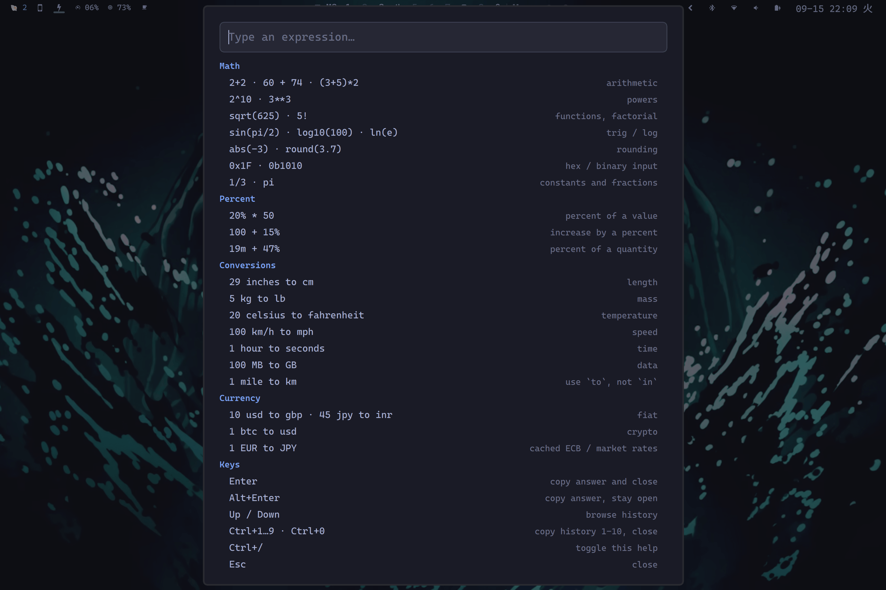

# Omarchy Qalculator

[](LICENSE)
[](https://www.qt.io/)
[](https://github.com/omarchy)
[](README.zh-CN.md)

> A Raycast-style quick calculator overlay for **Omarchy Shell** on Hyprland — press the hotkey, type an expression, watch the answer appear live, press <kbd>Enter</kbd> to copy it and get out of the way.

`omarchy-qalculator` (`icyleaf.qalculator`) wraps the battle-tested [`qalc`](https://qalculate.github.io/) engine in a single, focused overlay: arithmetic, powers, functions, unit conversion and currency, all evaluated offline against qalc's cached rates. No window to manage, no daemon of its own, no separate app to launch — just a keyboard-first surface that opens on the focused monitor and disappears the moment you are done.



---

## Why Qalculator?

Most desktop calculators are either a full app you have to find and close, or a terminal invocation that lives in your shell history. Qalculator is neither.

| Dimension               | omarchy-qalculator                                    | GNOME Calculator      | Raw `qalc` in a terminal         |
| :---------------------- | :---------------------------------------------------- | :-------------------- | :------------------------------- |
| **Invocation**          | Global hotkey, in-place overlay                       | App launcher + window | Open terminal, type, read, close |
| **Feedback**            | Live answer as you type (150 ms debounce)             | Click / keypad driven | Submit, then read                |
| **History**             | Persistent, deduplicated, one key to re-copy          | Session history panel | Shell scrollback                 |
| **Engine**              | Native `qalc` — units, currencies, functions          | Custom GPL engine     | Native `qalc`                    |
| **Footprint**           | One QML overlay, no resident process of its own       | Full GTK app          | Full `qalc` binary on every call |
| **Copy behaviour**      | <kbd>Enter</kbd> copies and closes                    | Manual select & copy  | Manual select & copy             |
| **Dependency handling** | Probed by absolute path, one-click install if missing | Bundled               | `qalc` must be on `PATH`         |

### Design goals

- **One keystroke to an answer.** The overlay opens focused, evaluates as you type, and copies on <kbd>Enter</kbd>. Nothing else competes for your attention.
- **Truthful output.** qalc's interactive mode echoes partial input (`1 +` answers `1`). Qalculator's evaluation gate suppresses those echoes, so you never copy a half-finished expression by mistake.
- **No silent failure.** External tools (`qalc`, `wl-copy`) are probed at startup; the card names what is missing and offers a one-click install instead of failing quietly.

---

## Features

- **Live evaluation** — the answer appears as you type (150 ms debounce). The evaluation gate rejects trailing operators and output-equals-input echoes.
- **Full qalc reach** — arithmetic, powers, functions, constants, unit conversion and currency (`2+2`, `sqrt(625)`, `29 inches to cm`, `10 usd to gbp`). Offline; qalc uses its cached exchange rates.
- **Copy on Enter** — <kbd>Enter</kbd> copies the answer and closes. <kbd>Alt</kbd>+<kbd>Enter</kbd> copies and keeps the overlay open for the next calculation.
- **Persistent history** — the last 50 successful expressions, newest first. Re-computing an expression moves it to the top instead of duplicating it. <kbd>↓</kbd>/<kbd>↑</kbd> walk the list into the input box one entry at a time, keeping the list visible and showing each entry's stored result.
- **Built-in help** — <kbd>Ctrl</kbd>+<kbd>/</kbd> swaps the history area for a syntax reference (math, percent, conversions, currency, keys), and swaps back. Both list areas share one seven-row preview height, so swapping them does not resize the card; a taller list scrolls.
- **Configurable input position** — the input box can sit at the `top`, `center` (default) or `bottom` of the surface, or the whole card centred as `window`. At `bottom` the history and help lists stack above it; otherwise they stack below. `top`/`bottom` keep a configurable edge margin (default 5%). Set both in the plugin's settings panel or inline in `shell.json`.
- **Focused-monitor overlay** — a fullscreen `PanelWindow` on the focused output, matching the emojis and clipboard overlays.
- **Missing dependencies?** — each external tool is probed once at load; a missing one shows a clickable notice that installs it.

---

## Keyboard Shortcuts

| Shortcut                                                                     | Description                                   |
| :--------------------------------------------------------------------------- | :-------------------------------------------- |
| <kbd>SUPER</kbd> + <kbd>=</kbd>                                              | Toggle the overlay                            |
| <kbd>Enter</kbd>                                                             | Copy the answer and close                     |
| <kbd>Alt</kbd> + <kbd>Enter</kbd>                                            | Copy the answer and stay open                 |
| <kbd>↓</kbd> / <kbd>↑</kbd>                                                  | Walk history into the input, newest first     |
| <kbd>Ctrl</kbd> + <kbd>1</kbd>…<kbd>9</kbd> / <kbd>Ctrl</kbd> + <kbd>0</kbd> | Copy history row 1–10 and close (empty input) |
| <kbd>Ctrl</kbd> + <kbd>/</kbd>                                               | Toggle the syntax help (empty input)          |
| <kbd>Esc</kbd>                                                               | Close                                         |

Conversions use qalc's `to` keyword (`10 usd to gbp`, `29 inches to cm`). qalc reads `in` as the inch unit, so `10 usd in gbp` is **not** a conversion — the help lists `to` examples only.

---

## Prerequisites

Ensure the following tools are available on your system:

- **Calculator engine**: `qalc` (Arch: the `libqalculate` package), probed at `/usr/bin/qalc`. Currency conversion uses qalc's cached rates; no network call is made by this plugin.
- **Wayland clipboard tooling**: `wl-copy` (part of `wl-clipboard`), probed at `/usr/bin/wl-copy`, for the copy action.

Both are checked once at load with `test -x` against their absolute paths — the plugin never resolves a binary through `PATH`. If either is missing, the overlay shows a notice naming the binary and its package; clicking it runs the Omarchy launcher to `omarchy pkg add libqalculate wl-clipboard` in a floating terminal and re-probes once that terminal closes. Everything else keeps working: a missing `qalc` disables live evaluation, a missing `wl-copy` disables copy (no false "Copied" confirmation).

---

## Installation & Setup

1. **Install Plugin via Omarchy CLI**:

```bash
omarchy plugin add https://github.com/icyleaf/omarchy-qalculator.git --enable
```

2. **Bind Global Hotkey** (in `~/.config/hypr/bindings.lua`):

`SUPER + =` is delivered as `code:21` (the `=` key without Shift), and Omarchy's default bind for that key is the tiling action "Shrink window left". Unbind it first, then bind the overlay:

```lua
-- ~/.config/hypr/bindings.lua
hl.unbind("SUPER + code:21")

o.bind("SUPER + code:21", "Qalculator", "omarchy-shell shell toggle icyleaf.qalculator '{}'")
```

The Shift/Alt/Ctrl resize variants of that key can be left intact.

---

## Input position

The `position` setting controls where the input box sits. It is a string enum with four values:

| Value    | Default | Input box                                                | History / help lists |
| :------- | :-----: | :------------------------------------------------------- | :------------------- |
| `top`    |         | Just under the top edge margin; card grows downward       | Below the input      |
| `center` |   yes   | Pinned to the vertical centre of the screen               | Below the input      |
| `bottom` |         | Just above the bottom edge margin                         | **Above** the input  |
| `window` |         | Card centred on the screen as a whole, input at its top   | Below the input      |

`window` is the original layout: the whole card is vertically centred, so it grows symmetrically and the input shifts as the list changes. `center` instead keeps the input itself fixed at the screen's centre and grows the card downward. With `bottom`, the lower area stacks above the input and grows upward.

For `top` and `bottom` the card is held back from the screen edge by the `edgeMargin` setting — a percentage of the panel height, default `5` (never less than the shell's outer gap), so it is not flush against the edge. `center` and `window` ignore it.

In every mode the lists are capped to the room left on their side and scroll internally when taller, and the card never leaves the panel.

Set these either through the plugin's settings panel, or inline on the plugin's entry in `~/.config/omarchy/shell.json`:

```json
{
  "plugins": [
    { "id": "icyleaf.qalculator", "position": "bottom", "edgeMargin": 5 }
  ]
}
```

The values are re-read on each summon, so an edit takes effect the next time you open the overlay without a shell restart. Any `position` other than the four above falls back to `center`, and a non-numeric or negative `edgeMargin` falls back to `5`.

---

## Update & Removal

- **Update Plugin**:

```bash
omarchy plugin update icyleaf.qalculator
```

- **Remove Plugin**:

```bash
omarchy plugin remove icyleaf.qalculator
```

### What removal leaves behind

`omarchy plugin remove` deletes the plugin directory and the enabled entry. It does **not** touch state the plugin wrote, because that data lives outside the plugin tree. The only persistent artifact is:

| Path                                                                    | Contents                            | On `plugin remove` |
| :---------------------------------------------------------------------- | :---------------------------------- | :----------------- |
| `${XDG_STATE_HOME:-$HOME/.local/state}/omarchy/qalculator/history.json` | The last 50 expressions and results | **Kept**           |

To delete it too (the directory is the plugin's own, so the whole tree goes):

```bash
rm -rf "${XDG_STATE_HOME:-$HOME/.local/state}/omarchy/qalculator"
```

Nothing else survives: there is no daemon, no socket, no systemd unit, no keyring entry, no sudoers or polkit rule, no package installed by the plugin, and no shared Hyprland or `shell.json` configuration is edited. The hotkey binding you added to `~/.config/hypr/bindings.lua` is _your_ configuration and is left as-is; remove those two lines by hand if you no longer want the bind.

The plugin performs no downloads, no package installs and no configuration writes on load — the one-click dependency install is the only action that installs anything, and it runs only when you click the notice.

---

## Architecture

| File            | Role                                                                                                                                              |
| :-------------- | :------------------------------------------------------------------------------------------------------------------------------------------------ |
| `manifest.json` | `kinds: ["overlay"]`, `activation: "on-demand"`, `keepLoaded: true`, plus the `position` and `edgeMargin` settings schema.                                              |
| `Overlay.qml`   | The overlay: input, live answer, notice, qalc process, clipboard process, dependency probe, settings reader, and block placement.                          |
| `HistoryList.qml` | The scrollable history rows, placed above or below the input by the overlay.                                                                            |
| `HelpList.qml`  | The scrollable syntax reference, placed by the same rule.                                                                                                  |
| `CalcModel.js`  | The pure-JS seam: history parsing/dedup/capping, text sanitising, output caps, result cleaning, the evaluation gate, the overlay's vertical layout geometry, settings parsing, and the help reference data. |
| `tests/`        | QML test suite covering `CalcModel.js`, plus `audit.sh` for the QML surface.                                                                      |

History is stored at `${XDG_STATE_HOME:-$HOME/.local/state}/omarchy/qalculator/history.json`, written atomically on commit only — partial keystrokes never reach disk. The plugin's directory is created and repaired at `0700`, the file at `0600`. When the new location has no history yet, the first run carries over a history left at the old flat path (`omarchy/qalculator-history.json`) and removes it — but only after the new file is written. The old file is left untouched if it holds nothing, if the new location already has history, or if the carry-over write fails.

### Bounds and hygiene

Anything that did not originate in this plugin is treated as data:

- Every rendered string is a `Text.PlainText` sink, so a crafted expression or a hostile history document can never be interpreted as rich text and trigger a resource load.
- Control characters (C0, C1, line separators, bidi controls) are stripped at ingestion in `CalcModel.js`, and expressions/results are capped in length before they are stored or shown.
- Child processes run from absolute paths with a constructed environment; their output is byte-counted as it streams and the child is signalled if it exceeds the ceiling, under an absolute deadline with TERM/KILL escalation.
- The history document is read with `dd iflag=nofollow,nonblock,count_bytes,fullblock` (so a symlink is refused, a FIFO cannot block the shell process, and an oversized file is detected rather than truncated) and written through a same-directory temporary created `0600` and renamed over the destination (so a planted symlink is replaced, never followed). Both scripts are constants with the path as an argument and the data on stdin.
- Entries read back from the history document are re-validated (shape, length, character set) rather than trusted.

### Tests

```bash
cd tests
qmltestrunner -input tst_calcmodel.qml
./audit.sh
```

The same checks are wired as [mise](https://mise.jdx.dev) tasks: `mise run check` runs the linter, the audit and the test suite. `mise run dev-deploy` copies this working tree into the installed plugin directory and restarts the shell, which QML changes need to take effect.

---

## Contributing

Contributions are welcome. Keep the pure logic in `CalcModel.js` where it is covered by tests, and keep the QML layer thin:

1. **Branch off `main`**, using a `<type>/<short-description>` name (e.g. `feat/`, `fix/`, `chore/`, `refactor/`).
2. **Verify locally** — run the test suite above before committing.
3. **Conventional Commits** — write clear commit messages (e.g. `feat(overlay): ...`, `fix(history): ...`).
4. **Submit a PR** against `main`.

---

## Credits

`omarchy-qalculator` stands on the shoulders of the open-source community:

- **[Qalculate! (`libqalculate`)](https://github.com/Qalculate/libqalculate)**: The calculation engine — units, currencies, functions and constants, all done by `qalc`.

---

## License

This project is open-sourced under the [MIT License](LICENSE).
